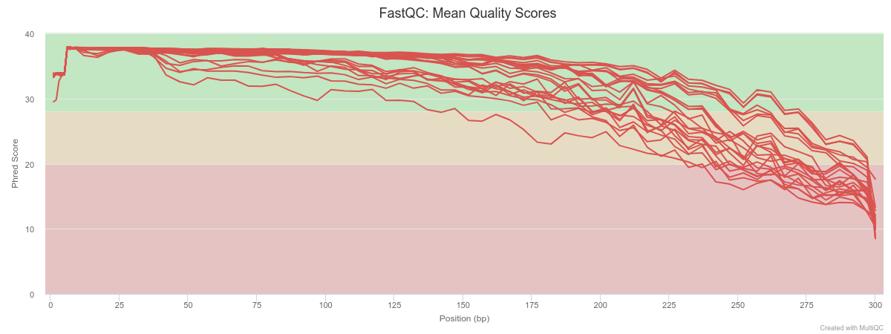
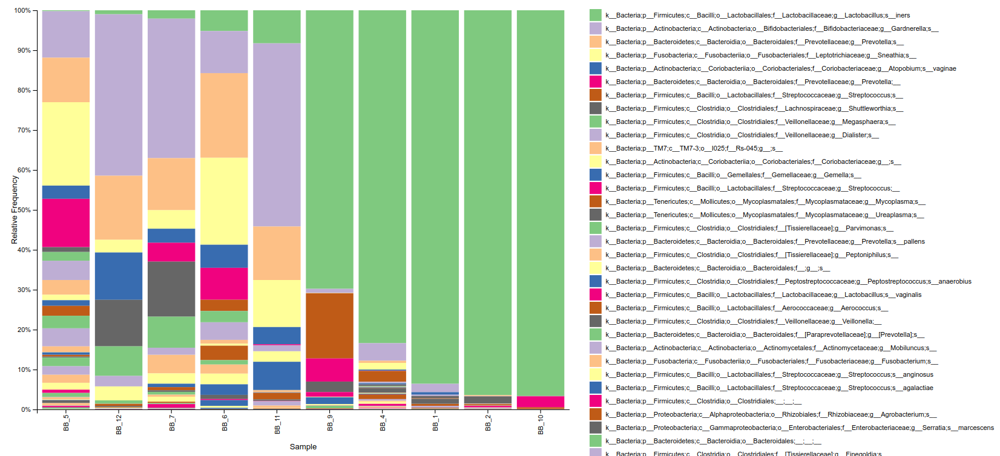

# Microbiomes Practical

 Bacterial vaginosis (BV) is a dysbiotic condition caused by excessive growth of certain bacteria replacing the regular vaginal microbiome. Common symptoms include increased discharge, burning with urination, and itching. BV increases the risk of infection by a number of sexually transmitted infections including HIV/AIDS as well as the risk of early delivery when pregnant. The changed composition of the microbiome leads to a higher pH and a hundred to thousand-fold increase in the total number of bacteria present.

For this practical we are considering 12 samples of vaginal swab that were taken at a polyclinic by a GP in a setting of high transmission of HIV. DNA was extracted from the swabs and amplified using primers specific for the first two hypervariable regions (V1 and V2) of the 16S rRNA gene (27F and 338R). These samples were then sequenced with MiSeq Illumina producing paired end data of 300 bp length per read. The 12 pairs of files generated are found in the data/metagenomics/fastq/ directory. The patients’ phenotype was determined by the doctors at the time of sample collection with the following results:

| Sample | BV  | pH  |
|--------|-----|-----|
| BB_1   | no  | 4.4 |
| BB_2   | no  | 3.6 |
| BB_3   | yes | 5.5 |
| BB_4   | no  | 5.3 |
| BB_5   | yes | 5.6 |
| BB_6   | yes | 5.3 |
| BB_7   | yes | 4.7 |
| BB_8   | no  | 4.4 |
| BB_9   | no  | 4.4 |
| BB_10  | no  | 3.6 |
| BB_11  | yes | 4.7 |
| BB_12  | yes | 5   |

## Analysing the microbiome samples with QIIME2

Out of all tookits aiming at the unification of the analysis of microbiome data, QIIME (pronounced "chime") and its successor QIIME2 have grown the largest user base in recent years (mostly due to the ease of use and comprehensive online documentation). QIIME2 wraps an extensive suite of third party tools (covering most of the "standard" microbiome pipeline from preprocessing and filtering of raw sequencing reads to statistical tests on diversity metrics and analyses on differential abundance of single taxa) into a single command line interface. In addition, it also provides a GUI as well as a python API for both less and more technically inclined users. We will stay on the middle ground by using the CLI today.
One idiosyncrasy of QIIME2 is the use of so-called "artefacts". These are zip-archives with a special file extension (.qza for data artefacts and .qzv for visualisation artefacts) that hold bulk data in addition to unique IDs and provenance metadata, which describe all steps that lead to the creation of that particular artefact. This has the advantage that for every intermediate or final result of qiime it is perfectly clear how it was generated from start to finish. There is a small downside, though, since we have to import our data into the QIIME2 format prior to running any analyses. However, before we do that, let's have a look at the quality of our reads (qiime also provides functionality for sequencing data quality control, but it is not as detailed as the output of some dedicated tools like FastQC). 

## Quality control

After activating the conda environment for this practical with `conda activate microbiome`, go into the module directory with `cd data/metagenomics` and have a look at its contents with `ls`. There should be a directory with the 16S sequencing data (in fastq), a 16S database (in db), and a CSV file with our metadata. Let's check if our reads are there with `ls fastq`. We can also have a look at the filesizes with `du -sh fastq/* | sort -h` (it can't hurt to get a feeling for these things). 

```
mkdir fastqc_reports

fastqc -o fastqc_reports -q -t 1 fastq/*
```

!!! info
    The -t flag tells fastqc the number of threads to use. If you have more CPUs available, adjust this number accordingly. 

This should produce a FastQC report for each fastq file and put them all into fastqc_reports (run `ls fastqc_reports` to double check). Going through 24 FastQC reports (two per sample; one for the forward and one for the reverse reads) manually would be quite tedious. Thankfully, multiqc can combine them for us! Let's create a new directory for it to write the results into and run it. 

```
mkdir fastqc_combined

multiqc -o fastqc_combined fastqc_reports
```

With `ls fastqc_combined` you can see that an HTML file, which we can view in a browser, has been created.

Scroll through the report and make note of the sequence counts barplots and the quality histograms. 




In the counts plot we can see that two samples (BB_3 and BB_8) have significantly fewer reads than the others. This looks like something went wrong during library preparation for these two samples and we should exclude them from further analysis. Also note that the reads of the other samples have decent quality up until ~200 bp length. We will need this information later. 

!!! question
    The difference in file sizes of the sequencing files between BB_3 / BB_8 and the other samples was not as drastic as the difference in actual read counts. Can you think of a reason why that might be? Hint: What does the file extension .gz mean? 

For this dataset, the primers have already been trimmed from the reads and the FastQC output showed us that there are no adapters that would need removal. Also, quality-based trimming is discouraged when using DADA2 (an important step in our later analyses). Therefore, no further pre-processing is needed and we can transform the data into the qiime format. 

## Import into qiime

In order to do this, qiime needs a tab-separated file with the sample IDs and the absolute paths to the forward and reverse reads. There are many ways to create such a file (and if you have just a few samples you can simply type it by hand). We will use the opportunity to string a few handy command line utilities together that we have not seen so far. First, let's write the header line of the import-list to a new file: 

```
printf \
    "sample-id\tforward-absolute-filepath\treverse-absolute-filepath\n" \
    > fastq_abs_paths
```

!!! info
    We use backslashs here to break this command into multiple lines. 

Then, we append the lines corresponding to our samples to the file that was just created. We can achieve this with 

```
ls fastq | grep -oE 'BB_[0-9]+' | sort -t _ -k 2 -n | uniq | \
      grep -vE 'BB_[38]' | \
      awk -v path=$(pwd)/fastq/ 'OFS="\t" \
          {print $1, path $1 "_1.fastq.gz", path $1 "_2.fastq.gz"}' \
      >> fastq_abs_paths
```

!!! info
    With the first grep we get the sample IDs from the filenames. We then sort them numerically (-n) based on the second field (-k 2) when split at underscores (-t _). Since there are two files per sample, we only keep the uniq sample IDs before removing the low-read-counts samples (BB_3 and BB_8) with another grep (grep -v keeps all lines that do not match the regex). The remaining sample IDs are subsequently fed to awk in order to print the absolute paths which are finally appended to fastq_abs_paths. 

This should have done the trick. `cat fastq_abs_paths` let's us see what we got. The output should look like this: 

```
sample-id       forward-absolute-filepath       reverse-absolute-filepath
BB_1    /home/user/data/metagenomics/fastq/BB_1_1.fastq.gz      /home/user/data/metagenomics/fastq/BB_1_2.fastq.gz
BB_2    /home/user/data/metagenomics/fastq/BB_2_1.fastq.gz      /home/user/data/metagenomics/fastq/BB_2_2.fastq.gz
BB_4    /home/user/data/metagenomics/fastq/BB_4_1.fastq.gz      /home/user/data/metagenomics/fastq/BB_4_2.fastq.gz
BB_5    /home/user/data/metagenomics/fastq/BB_5_1.fastq.gz      /home/user/data/metagenomics/fastq/BB_5_2.fastq.gz
BB_6    /home/user/data/metagenomics/fastq/BB_6_1.fastq.gz      /home/user/data/metagenomics/fastq/BB_6_2.fastq.gz
BB_7    /home/user/data/metagenomics/fastq/BB_7_1.fastq.gz      /home/user/data/metagenomics/fastq/BB_7_2.fastq.gz
BB_9    /home/user/data/metagenomics/fastq/BB_9_1.fastq.gz      /home/user/data/metagenomics/fastq/BB_9_2.fastq.gz
BB_10   /home/user/data/metagenomics/fastq/BB_10_1.fastq.gz     /home/user/data/metagenomics/fastq/BB_10_2.fastq.gz
BB_11   /home/user/data/metagenomics/fastq/BB_11_1.fastq.gz     /home/user/data/metagenomics/fastq/BB_11_2.fastq.gz
BB_12   /home/user/data/metagenomics/fastq/BB_12_1.fastq.gz     /home/user/data/metagenomics/fastq/BB_12_2.fastq.gz
```

Great! This should be sufficient to let QIIME2 know where the files that we want to import are. Now, we can import the reads with 

```
qiime tools import \
    --type 'SampleData[PairedEndSequencesWithQuality]' \
    --input-path fastq_abs_paths \
    --output-path fastq_imported.qza \
    --input-format PairedEndFastqManifestPhred33V2
```

This hopefully finishes successfully in a few seconds. Afterwards, you can check whether a new file was created with ls (which is slowly becoming our best friend now – right after cd of course). 

qiime also requires the metadata to be in TSV (tab-separated values), whereas our file is a CSV (comma-separated). We can simply fix this with 

```
cat meta.csv | tr ',' '\t' > meta.tsv
```

## Denoising with DADA2

Now that we have imported the data we can unleash the power of qiime! Sequence denoising (or OTU clustering) is the centrepiece of every 16S pipeline. We will use the DADA2 which fits a sequencing error model to the data and tries to merge ("denoise") sequences that differ only due to sequencing errors as opposed to actual biological variation. 

```
qiime dada2 denoise-paired \
    --i-demultiplexed-seqs fastq_imported.qza \
    --p-trunc-len-f 190 \
    --p-trunc-len-r 190 \
    --p-n-threads 1 \
    --verbose \
    --o-table table.qza \
    --o-representative-sequences rep_seqs.qza \
    --o-denoising-stats denoising_stats.qza
```

This will produce an artefact holding a list of unique sequences (rep_seqs.qza) as well as a table with the number of occurrences of each representative sequence per sample (table.qza). DADA2 fits the error model on all reads of a sequencing run simultaneously (as opposed to Deblur, which fits it separately for each sample). It is therefore considerably slower and we will have to wait a few minutes for it to finish. In the meantime you can have a look at the later sections of the practical. 

!!! info
    If applicable, increase the number of threads in order to speed things up.
    Hint: You can put time in front of any command to see how long it took. Try it with time sleep 5 in a new terminal.
    Also note that we told the program to truncate forward and reverse reads after 190 bp due to the decrease in quality we saw in multiqc_report.html. As the amplicon is only expected to be ~310 bp long, this should still give us sufficient overlap. 

## Building a tree

qiime includes a tree-building pipeline which allows us to generate a phylogenetic tree from the denoised sequences with a single command. MAFFT is used for the alignment and multiple tree-inference methods are available (have a look at qiime's phylogeny plugin for details). We will use FastTree, which is the fastest but also least accurate option available. 

```
time qiime phylogeny align-to-tree-mafft-fasttree \
    --i-sequences rep_seqs.qza \
    --o-alignment aligned_rep_seqs.qza \
    --o-masked-alignment masked_aligned_rep_seqs.qza \
    --o-tree unrooted_tree.qza \
    --o-rooted-tree rooted_tree.qza
```

As you can see, this will create an alignment, mask locations that aligned badly, and then generate the tree (unrooted and rooted at midpoint). 

!!! info
    We have built a new tree here because the pipeline with FastTree runs quite quickly and we don't want to have to wait during the practical. However, instead of creating one from scratch, we could have also inserted our sequences into an existing phylogeny. qiime offers pre-computed trees for two popular 16S databases and an insertion algorithm in the fragment-insertion plugin.
    In general, it needs to be said that phylogenomics is an incredibly deep topic. Since the tree is not substantial for our analysis, we can simply use qiime's pipeline with the default parameters. However, if you ever rely on a high-quality phylogeny for a different project, you should definitely try to find the best approach for your data and have a close look at the respective literature. 

## Estimating diversity

One reason for generating a phylogeny in a microbiome analysis is so that it can be used in phylogeny-based diversity metrics. Let's generate these now. Before we can run the corresponding command, though, we need to look up the lowest number of denoised reads per sample. 

!!! info
    Large differences in sequencing depth between samples can distort the results of diversity estimates. Therefore, it is common practice to down-sample (in ecology-speech "rarify") the reads of each sample to a number that is equal or smaller than the number of reads in the least deeply sequenced sample. This simply means that we randomly select N reads from each sample where N is the smallest number of reads in any sample. 

To check the number of denoised reads per sample, we can create a qiime visualisation of our counts table with 

```
qiime feature-table summarize \
    --i-table table.qza \
    --o-visualization table.qzv
```

Visualisation files are produced by certain qiime commands and provide human-readable information like plots, tables, or summary statistics. There are several ways to view such files. The easiest one is to go to https://view.qiime2.org/ and drag & drop them into your browser window. 

Note that the tables and plots generated at https://view.qiime2.org/ are all rendered in your local browser and that nothing is uploaded to be processed on an external server, which is often required when working with sensitive data. 

Once the visualisation has loaded, there should be a table looking like this: 


So, we need to rarify to a sampling depth of 24,336 reads. Let's generate the diversity metrics now (again, adjust the number of threads according to your setup): 

```
qiime diversity core-metrics-phylogenetic \
    --i-phylogeny rooted_tree.qza \
    --i-table table.qza \
    --p-sampling-depth 24366 \
    --p-n-jobs-or-threads 1 \
    --m-metadata-file meta.tsv \
    --output-dir core-metrics-results
```

This will generate a new directory core-metrics-results holding (based on multiple different diversity metrics) sample-wise diversity values ("alpha diversity"), pairwise inter-sample distance matrices ("beta diversity"), and visualisations of PCoA plots (ending in .qzv). These can again be inspected with https://view.qiime2.org/. For example, the PCoA plot based on Bray–Curtis distance with BV-negative samples in red and BV-positive samples in blue looks like this: 


!!! question
    What does the plot tell us about our samples and the impact of BV on inter-sample diversity. Look up the term "Anna Karenina Principle" and what it means in terms of the microbiome. Can we say that it applies to our data? 

## Taxonomic classification

We are not only interested in the ecological diversity of our samples; we also want to know which species were found. Again, there are multiple ways of achieving this. We will use a Naïve Bayes classifier (pre-trained on the Greengenes 13_8 database) available from the Qiime2 website. You can find it in the db directory and use it with the following command: 

```
qiime feature-classifier classify-sklearn \
    --i-classifier db/gg-13-8-99-nb-classifier.qza \
    --i-reads rep_seqs.qza \
    --p-n-jobs 1 \
    --o-classification taxonomy.qza
```

The produced table in taxonomy.qza simply links the taxonomic classifications (from phylum to species level) to the corresponding sequences. If you want to inspect the table, run 

```
qiime metadata tabulate \
    --m-input-file taxonomy.qza \
    --o-visualization taxonomy.qzv
```

and open the visualisation taxonomy.qzv in https://view.qiime2.org/. 

To get a more intuitive understanding of the microbial composition of our samples we can now ask qiime to plot it for us: 

```
qiime taxa barplot \
    --i-table table.qza \
    --i-taxonomy taxonomy.qza \
    --m-metadata-file meta.tsv \
    --o-visualization taxa_barplot.qzv
```

The resulting visualisation at species level ("Level 7") looks like this in https://view.qiime2.org/: 



!!! info
    You can adjust the with of the bars with the slider above the plot. 

!!! question
    We can see that some samples are dominated by Lactobacillus iners (green), whereas for others the situation looks very different. Double check with the metadata to find out if this is associated with BV-status. 

## Testing differences in alpha diversity

Alpha diversity measures the general diversity of an ecosystem (i.e. a sample in our case) or a group of ecosystems (i.e. groups of samples like all samples with BV). After looking at the taxa barplot we just generated, do you think that the BV samples are statistically significantly more diverse than the non-BV samples? We can check if your estimate is correct by running a Kruskal–Wallis test on the four metrics of alpha diversity that we calculated for our samples. Let's create a new directory to write the results into and run: 

```
mkdir alpha_tests
for metric in faith_pd evenness shannon observed_features; do
    qiime diversity alpha-group-significance \
        --i-alpha-diversity core-metrics-results/${metric}_vector.qza \
        --m-metadata-file meta.tsv \
        --o-visualization alpha_tests/${metric}_group_significance.qzv
done
```

This produces four more visualisations. Have a look at them. Were you right? 

!!! question
    It looks like the different alpha diversity metrics disagree! After reading the short definitions of the metrics provided below, can you think of a reason for this discrepancy?
    faith_pd: Faith's phylogenetic diversity is defined as the sum of branch-lengths in the phylogeny between all species found in a sample (regardless of abundance).
    evenness: Pielou's evenness index quantifies how differently abundant species making up an ecosystem are.
    shannon: The Shannon index or Shannon entropy quantifies how difficult it is to guess the species of a random specimen taken from the sample (the more species and the more equally abundant they are, the more difficult).
    observed_features: Simply the number of unique taxa found in the sample. 

## Testing beta diversity

As opposed to alpha diversity, which quantifies the diversity of a sample (or a group of samples) overall, beta diversity gives an estimate of the magnitude of differences between individual samples or groups of samples. We can test the difference between BV and non-BV samples for all beta diversity metrics with the following command: 

```
mkdir -p beta_tests

for metric in bray_curtis jaccard unweighted_unifrac weighted_unifrac; do
    qiime diversity beta-group-significance \
        --i-distance-matrix core-metrics-results/${metric}_distance_matrix.qza \
        --m-metadata-file meta.tsv \
        --m-metadata-column BV \
        --o-visualization beta_tests/${metric}_significance.qzv \
        --p-permutations 9999
done
```

Again, we got a visualisation for each metric. Have a look at them in https://view.qiime2.org/. What do you find? Are all of them in agreement this time? 

This concludes today's practical. If you are interested in differentially abundant taxa between the BV and non-BV samples, have a look at qiime's' ANCOM function. 

Acknowledgements: Many thanks to Dr. Suzanna Francis for providing the data and Ernest Diez-Benavente and Julian Lisebber-Egger for designing the practical materials.


