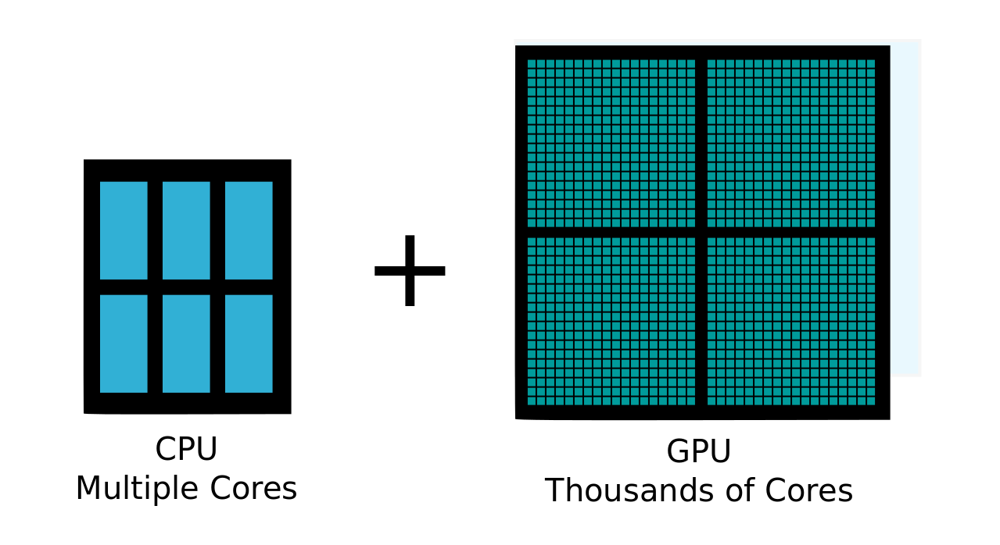
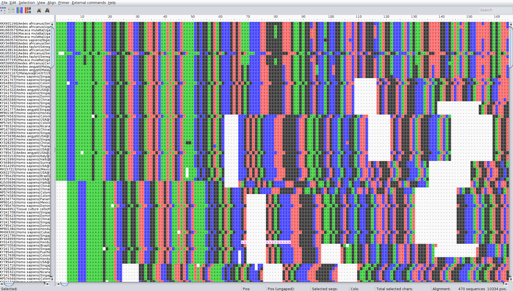
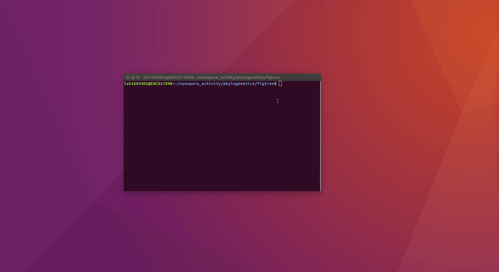
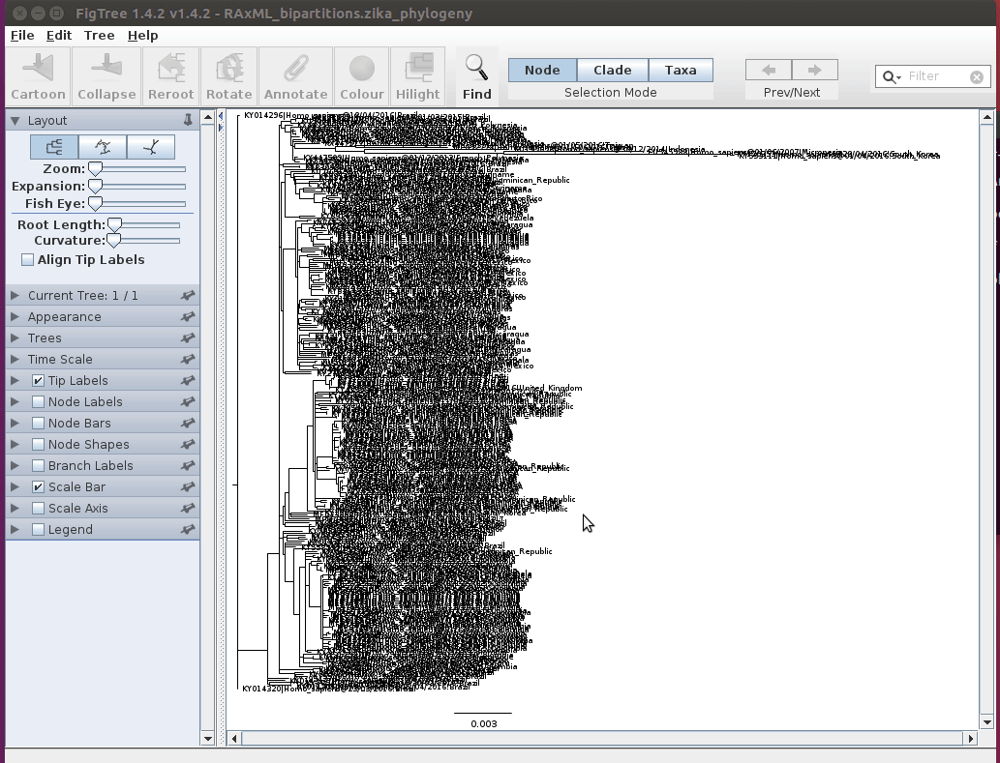

# Third Generation Sequencing

## Introduction

In this session we are going to be looking at data generated by third-generation nanopore sequencing technology. Developed by Oxford Nanopore Technologies (ONT), these platforms, rather than the next-generation 'sequencing-by-synthesis approach', make use of an array of microscopic protein ‘pores’ set in in an electrically resistant membrane which guide strands of DNA or RNA through them. Each nanopore corresponds to its own electrode connected to a channel and sensor chip, which measures the electric current that flows through the nanopore. When a molecule passes through a nanopore, the current is disrupted to produce a characteristic ‘squiggle’. The squiggle is then decoded using basecalling algorithms to determine the DNA or RNA sequence in real time. Oxford Nanopore’s most popular platform is the MinION which is capable of generating single reads of up to [2.3 Mb](https://ib.bioninja.com.au/_Media/genome-size-table_med.jpeg) (2.3 million bases).


The MinION is one of 5 scalable platforms developed by ONT. High-throughput applications such as the GridION and PromethION use an array of nanopore flowcells to produce between 5 to 48 times more data than the MinION alone – outputting up to 48 TB of data in one run. More downscaled solutions such as The Flongle and SmidgION use a smaller, single flowcell to generate data. The MinION is a highly portable sequencing platform, about the size of a large USB flash drive. This technology enables researchers to perform sequencing analyses almost anywhere, providing they have the correct equipment to prepare the DNA libraries and analyse the output data.


A complete sequencing run on the MinION platform can generate upwards to of 1TB of raw data, and downstream analyses require a significant amount of computing power, multicore high performance processors and large amounts of RAM. This poses a significant logistical challenge for researchers who want to take advantage of the platform’s portability aspect. Over recent years, the integration of GPUs (graphics processing units) has made it easier to analysis workflows.

## Software and Data Requirements

We will be using the following software and data in this activity:

1. NanoPlot - to visualise the summary statistics of the sequencing run
2. chopper - for quality control
3. kraken2 - to identify the taxonomic classification of the reads
4. minimap2 - to map the reads to a reference genome
5. samtools - to manipulate the alignment files
6. freebayes - to call variants from the alignment files
7. bcftools - to manipulate the variant calling files
8. iqtree - to infer the phylogenetic tree
9. figtree - to visualise the phylogenetic tree
10. igv - to visualise the alignment files
11. aliview - to visualise the alignment files
12. R - to generate plots

We will now use mamba to create an environment to install the required software. 

```
mamba create -n ont nanoplot chopper kraken2 minimap2 samtools bcftools freebayes iqtree igv figtree aliview r-base
```

We will also be using data from the [this study](https://journals.plos.org/plosone/article?id=10.1371/journal.pone.0313545). 

!!! Question
    Have a look at the paper abstract and the methods section to get a feel for the data we will be working with. The methods state that amplicon sequencing was used. Why do you think this is?
    Which sequencing kit was used to generate the data?

We will use data from two samples. The data is available from the [ENA](https://www.ebi.ac.uk/ena/browser/home) under the following accessions:

1. SRR26779702 - We will first use this sample to demonstrate the analysis pipeline.
2. SRR26779678 - You will use this sample to perform the analysis yourself.

Download the fastq data and put it into the folder `~/data/nanopore_activity/`. 

## Activity Briefing

We will follow a typical nanopore data analysis pipeline to produce a whole-genome Zika virus sequence to explore the capabilities of nanopore sequencing and the kind of data it can produce. We will then use maximum-likelihood (ML) techniques for phylogeographic reconstruction, to try and find out where our isolates came from and place it in the context of the wider South American Zika.

## Basecalling

Basecalling is performed with a tool called `dorado`. This tool is used to convert the raw signal data generated by the MinION into a sequence of nucleotides. The basecaller uses a neural network to predict the sequence of bases from the raw signal data. The output of the basecaller is a fastq file, which contains the basecalled sequence, as well as other information about the read, such as the quality scores of the basecalls. 

Basecalling required the use of advanced machine learning models, and can be computationally intensive. For this reason, basecalling is often performed on a high-performance computing cluster with a graphics processing unit. In this activity, we will use a pre-basecalled dataset to save time.

     

## Quality Control

Before moving on to the analysis steps, it is important to gauge the quality of your sequencing output. There are numerous factors which dictate the quality of the output data, spanning between quality of the input material, library preparation to software and hardware failure. We will look at some important metrics that can be calculated from the sequencing data to assess the quality of the run.

In order to get the run metrics in to a useful form, we will use `NanoPlot` to produce a range of plots in a HTML output, which we will use to judge the quality of the sequencing run. 

```
NanoPlot --fastq SRR26779702_1.fastq.gz -o SRR26779702_qc --N50 
```

!!! info
    After executing the command you should find a file called 'SRR26779702_qc/NanoPlot-report.html'. Open them up in the file manager or in the terminal (with the below command) and inspect some of the plots and see what you can find out. 

```
firefox SRR26779702_qc/NanoPlot-report.html
```

Before continuing, quit firefox by clicking the X in the top right corner of the web-browser window.

!!! question
    What is the N50 of the reads? Do you think this is a good N50 value for this type of sequencing?

## Quality filtering

The next step in the analysis is to filter out any low-quality reads. This is important because low-quality reads can introduce errors in the downstream analyses, such as mapping and variant calling. We will use a tool called `chopper` to trim the reads and remove any low-quality bases. 

```
chopper -q 10 -i SRR26779702_1.fastq.gz > SRR26779702.filt.fastq
```

The `-q` flag specifies the quality threshold for trimming. In this case, we are using a threshold of 10, which means that any read with a quality score below 10 will be dropped. The `-i` flag specifies the input file, and the output file is specified with the `>` symbol.

!!! Question
    === "Question 3"
        How many reads were filtered out?
    === "Answer 3"
        12028 reads were filtered out. 

## Kraken QC

Another method of quality control is to check our reads for sequence contamination from other 'off-target' organisms. This is important in order to firstly, understand how effective your DNA extraction, enrichment and sequencing was. And secondly, to prevent anomalous reads from being incorporated in to assemblies.

Using our basecalled reads we will perform an analysis using kraken2. Kraken2 is a tool which sifts through each read in a .fastq file and crosschecks it against a database of microorganisms. The output is a taxonomic assignment of each read, enabling to identify if any contamination has occurred. In this case we will be looking for any reads which do not belong to the Zika genome. Type the following command in to the terminal to unleash the Kraken:

```
kraken2 --db db/ SRR26779702.filt.fastq --report SRR26779702.report.txt --output SRR26779702.output.txt
```

The `--db` flag specifies the database to use. In this case we are using a database with only viral sequences. The `--report` flag specifies the output file for the report, and the `--output` flag specifies the output file for the taxonomic assignments.

### Kraken Report

The report generated by Kraken is a tab-delimited file which contains a list of all the reads in the input file, and the taxonomic assignment of each read. The first column is the read ID, the second is the taxonomic ID, the third is the length of the read, and the fourth is the lowest common ancestor (LCA) of the taxonomic assignment. The LCA is the lowest taxonomic rank that all the taxonomic assignments share. The report is useful for identifying the taxonomic assignments of reads, and for identifying any contamination in the dataset.

### Kraken Output

The output generated by Kraken is a tab-delimited file which contains the taxonomic assignment of each read. The first column is the read ID, the second is the taxonomic ID, the third is the length of the read, and the fourth is the taxonomic assignment. The output is useful for identifying the taxonomic assignments of reads, and for identifying any contamination in the dataset.


## Mapping and Visualisation

Now that we have varified a successful sequencing run, our basecalled and QC'd Zika-confirmed data are ready to go, we will now map the reads on to a reference genome and perform variant calling. For the first step we will use the minimap2 program. You can find more information about this tool by clicking the link [comparing the two alignment tools](https://lh3.github.io/2018/04/02/minimap2-and-the-future-of-bwa)

```
minimap2 reference.fasta SRR26779702.filt.fastq -ax map-ont | samtools sort -o SRR26779702.bam -
```

This command contains two parts: 

1. the first part is the `minimap2` command, which is used to map the reads to the reference genome. The `-ax` flag specifies the type of alignment to perform. In this case, we are using the `map-ont` option, which is specifically designed for mapping ONT reads. 
2. The second part is the `samtools sort` command, which is used to sort the output of the minimap2 command. The `-o` flag specifies the output file, and the `samtools sort` command sorts the output by reference position.


## Visualisation

Now that we have successfully mapped the reads to a reference we can visualise them in IGV, to get a closer look at what our sequencing run looks like. Before we do that we need to index the bam file so that IGV can read it. 

```
samtools index SRR26779702.bam
```

Next we can start IGV by typing the following command in to the terminal:

```
igv
```

As you have learned before, open up the reference (reference.fasta) in IGV and then load the bam file (SRR26779702.bam) in to the viewer.

!!! question
    Can you see any difference between this data and the illumina data you have previously analysed? What do you notice about the coverage of the reads? Are there any regions which have a high depth of coverage? What do you notice about the quality of the reads? Can you see any regions which have a high frequency of mismatches?


!!! info
    An important aspect of an effective nanopore sequencing analysis is being able to differentiate between errors or low quality basecalls, and true SNPs. You can see that there are random errors dotted around the screen, like static on a TV. Do you notice that some positions in the alignment have a distinct vertical column of red squares. These are most likely the variants we are looking for, and the key to unlocking our sequence data. These columns represent positions which have a high frequency of basecalls which do not agree with the reference sequence. It is unlikely that random errors will appear in such a manner, and so, in our next analysis we will use these high frequency variants to alter the reference sequence to build a new sequence, in a process called ‘variant calling’.

## Depth and Coverage

!!! info
    Variant calling is a process used to identify new genotypes based on the ‘differences’ found our read data. You will have used it in the previous mapping practical at the start of the course. In this case, we are going to be using the alignment you have just generated and compiling a database of SNPs, inferred from positions which have a majority allele which is different from the one found on the reference sequence.

Before starting on variant calling, we first need to do one more QC step. This analysis will tell us how well our reads have aligned to the reference and how comprehensive our sequencing run was. Two key metrics are required for this: reference coverage and read depth. Read coverage tells us the percentage of the reference which has had sequencing reads aligned to it, which allows us to identify any regions that may have not been successfully sequenced. Depth is an equally as important metric: it tells us how many different reads have mapped to the same position. This is a particularly important statistic if you intend on doing variant calling, as regions with low depth may fall prey to false calls due to the random errors we have in our nanopore data. With a high enough read depth, we can be fairly sure that these errors will be ignored.

We will now use R to generate a plot to allow us to assess the coverage and depth.

We need to use samtools, a versatile package you will be familiar with, to extract the depth statistics from the .bam alignment file we generated in the previous section. This will generate a file called SR26779702.depth.txt. The command is as follows:

```
samtools depth -a SRR26779702.bam > SRR26779702.depth.txt
```

Next, we will use the R statistical package to generate a plot based on the data samtools generated. Simply type ‘R’ in to the terminal to initialise the R interface.

```
R
```


Once you have initialised R, you can enter the following two lines of code, one after the other. The first command will load the ‘ depth_statistics’ file, and the second will generate the plot

```
data<-read.table("SRR26779702.depth.txt",header=F)
```

```
plot(data$V3,type="l",xlab="Reference Position", ylab="read Depth")
```

!!! info
    Take a look at the plot you have just generated in R. Does the genome have adequate coverage and depth? What do you notice about the depth of the reads of nanopore generated data, as opposed to Illumina? Furthermore, why do you think there are these block-like increases and decreases in the depth? (Hint: how do you think these sequencing libraries were generated?)

You can also calculate some basic statistics about the depth of coverage. The following command will calculate the min, Q1, median, Q3 and max of the depth of coverage:

```
summary(data$V3)
```

!!! Question
    === "Question 4"
        What is the minimum depth of coverage?
    === "Answer 4"
        73

You can quit R by typing:

```
quit()
```

## Variant Calling

!!! info
    Now that we know the coverage and depth, we can move on to the variant calling. For this, we will use a package called freebayes. Freebayes will look through the alignment and ‘call’ the positions which do not agree with the reference, count them and compile them in to a database called a VCF. Enter the following code in to the terminal to begin the process:

```
freebayes -f reference.fasta SRR26779702.bam  -F 0.6 | bcftools view -Oz -o SRR26779702.vcf.gz
```

The `-f` flag specifies the reference genome to use, and the `-F` flag specifies the minimum allele frequency to call a variant. In this case, we are using a threshold of 0.6, which means that any position with an allele frequency below 0.6 will be ignored. The `bcftools view` command is used to convert the output of freebayes to a VCF file, which is a standard format for storing variant data.

Let's take a look inside the VCF file to see what kind of data it contains:

```
zcat SRR26779702.vcf.gz | less
```

!!! info
    You can scroll down using the down-arrow key on your keyboard. Can you recall the common features of a VCF file? Press 'q' to quit the 'zless' program to continue with the activity:

Next, we need to index the .vcf.gz file. This is a necessary step before we can use the VCF file in the next step of the analysis. The command is as follows:

```
bcftools index SRR26779702.vcf.gz
```

# Consensus generation

!!! important
    It is important to understand how the reference sequence can effect the consensus outcome. If unchecked, positions with zero coverage will default to reference. This will result in the experimental sequence becoming more like the reference than it actually is. We can use BEDtools mark positions with low coverage which BCFtools will use to mask the zero coverage positions with 'N's. 

We will first generate a bed file with the positions of the low coverage regions. The command is as follows:

```
awk '$3<100' SRR26779702.depth.txt | awk '{print $1"\t"$2-1"\t"$2}' > SRR26779702.low-dp.bed
```

This command will generate a bed file with the positions of the low coverage regions. The first awk command will filter the depth file to only include positions with a depth of less than 100. The second awk command will format the output to be in bed format, which is required by bedtools. Bed format is a tab-delimited format which contains the chromosome name, start position and end position of regions of interest, which are the low coverage regions in this case.

This next line of code will take the calls made in the VCF file and apply them to the reference sequence, changing it based of the differences observe in our reads:

```
bcftools consensus -f reference.fasta -p "SRR26779702 " --mask SRR26779702.low-dp.bed -M N SRR26779702.vcf.gz  > SRR26779702.consensus.fasta
```

This command will generate a new fasta file called ‘SRR26779702.consensus.fasta’. This file contains the modified reference sequence, which has been altered based on the differences observed in our reads. The `-p` flag specifies the prefix for the sequence name in output file, and the `-f` flag specifies the reference genome to use. The `--mask` flag specifies the bed file to use, and the `-M` flag specifies the character to use for low coverage positions. In this case, we are using 'N' to mask the low coverage positions.


!!! info
    You will now have a file called ‘consensus_sequence.fasta’. this contains the modified reference, a brand new sequences based on the sequence data we have been working with.


## Now do it all again!

Now that you have completed the first part of the activity, you will now repeat the process with a different sample. The sample you will be using is SRR26779678. You will need to download the fastq file from the ENA and place it in the same folder as before.


## Sequence Alignment

Now we are going add our consensus sequence to a multiple sequence alignment, to prepare the dataset for phylogenetic inference. The `zika_dataset.fasta` file contains several publicly available ZIKV isolates. Let’s open up the dataset in an alignment viewer and take a look at that this kind of data looks like. Like most of the tools you have encountered during this course there are many alternative programs out there that will perform similar tasks, in this instance we will use Aliview. Let’s call up the program and load our dataset:

```
aliview zika_dataset.fasta
```



With Aliview open, you should now see the dataset we will be working with for the rest of the activity. In the left pane you should see the sequence metadata: the unique sequence accession number, the species the virus was isolated from, the country of origin and the date of collection. Spanning across horizontally, you should see the genome sequence to which the metadata is associated with. On the pane at the bottom of the window, you should see a few statistics about the dataset. Have a browse and familiarise yourself with the data and the software interface.

!!! question
    === "Question 5"
        How many sequences are there in the _Zika_ dataset?
    === "Answer 5"
        284

Before we continue with any analyses, we first have to add our new sequences and then align the dataset. Alignment is the process of arranging sequence data in such a way that each sequence may be compared to each other. For this we will use a program called ‘mafft’. This program will rearrange the sequences based on similarity, so that they may be compared in future analyses.

Close the Aliview window, and open up the terminal ensuring you are still in the ‘phylogenetics’ directory. First, we will add our new consensus sequence to the database by using the ‘cat’ (concatenate) command:

```
cat SRR26779702.consensus.fasta SRR26779678.consensus.fasta zika_dataset.fasta > unaligned.fasta
```

Next, we will call up the alignment program and point it in the direction of our unaligned ‘unaligned.fasta’ dataset. The alignment command is made up of the following elements:

```
mafft zika_all.fasta > zika_all_aligned.fasta
```

The `mafft` command calls the alignment program, and the `>` symbol specifies the output file. The `zika_all.fasta` file is the input file, and the `zika_all_aligned.fasta` file is the output file.

The program may take a short while to run. Alignments generally can take a very long time; some of you may be familiar with using the ClustalO or MUSCLE web-based servers. While these are a few of the more popular options, MAFFT has its merits, particularly in being able to build large alignments in an exceptionally short amount of time.

!!! info   
    Once the program has completed, you should find a file called ‘zika_all_ailigned.fasta’. Open it up in Aliview and inspect the sequences. Comparing this to the unaligned dataset, can you see how easy it is now, to compare each sequence and visualise the diversity across the dataset. With our sequence added to the dataset, we can now move on to the final section of the activity: phylogenetics.


## Phylogenetics: iqtree

IQ-Tree is the tool we will be using today to infer our phylogenetic tree. It is a popular program for phylogenetic analyses of large datasets. Its main strengths are its speed and a robust search algorithm resulting in phylogenies with good likelihood scores. The maximum likelihood method uses standard statistical techniques for inferring probability distributions, and to assign probabilities to particular possible phylogenetic tree topologies (the shape of the tree). Hopefully you should be familiar with the basic concepts underpinning phylogenetics, and their applications: so let’s get stuck in.


Now we have our multiple sequence alignment, we can now start the phylogenetic inference. The following command consists of these elements:


```
iqtree -s ./zika_all_aligned.fasta -bb  -nt AUTO
```

!!! info
    Inferring phylogenies is a complex process can take a very long time, depending on the program you use and the size of the dataset. Because we will not have access to HPC (High Performance Computing) in this activity, we will run only 1 inference. However, in the next step, you will be provided with a tree inferred with the same data, but run with 1000 inferences i.e the program will have been run 1000 times. This gives the program the opportunity to explore the phylogenetic landscape further, so that the resultant tree is the most probabilistically robust.


!!! info
    If you have any questions about this phylogenetic application, or any others you are aware of, don't hesitate to ask a demonstrator.

Now that iqtre has completed its run we can now visualise the results in Figtree – a phylogenetic tree visualisation software package.

**Run the following command:**

```
figtree ./zika_all_aligned.fasta.treefile
```



Now that you have opened up the tree in Figtree, you first need to assign the bootstrap data to a category. We can then organise the tree in a way that it is more easy to view. Using the animation below as a guide, select the 'Midpoint Root' and 'Increasing Node Order' settings.



Use the scroll bars in the Figree window, and on the pane on the left hand side of the windows to zoom and navigate the tree.

**You can use the search bar in the top right corner of the screen to find our 'CONSENSUS' sequence.**

!!! info
    Now that we can see where our sequence falls on the tree, we can look in to the geographical and chronological metadata in our dataset and the structure of the tree, to gain a deeper understanding of what happened during the Zika outbreak in the Americas.

       

!!! question
    === "Question 6"
        What is the closest ancestor of our sequence?
    === "Answer 6"
        Brazil - 13/04/2016


!!! info
    What can you tell about the outbreak from the topology (shape and order) of the tree? Can you see distinct clades (groupings) in the overall structure of the tree? As you follow the nodes in each clade further in to the tree, towards the leaves, what to notice about the geography of the isolates in this dataset? Can you tell where most of the lineages began?

**We can use the phylogenies similar to the one we have just generated to map transmission and the spread of diseases.**

!!! info
    Click on the 'Phylogeography Map' link. the program it will take you to was built using a similar Zika dataset that we have used today, with a few extra added isolates. To generate this map, we used Bayesian ancestral state reconstruction with a molecular clock to map the spread of Zika during the 2015-16 outbreak. Do you notice the similarities between the structure of the tree in Figtree and the phylogeographic map?

[Phylogeography Map](https://jodyphelan.github.io/genomics_course/phylogeography/index.html)

## Conclusion

Hopefully having completed this activity, you will have gained a better understanding of how to process third-generation nanopore data, and the applications of such a technologies in an infectious disease outbreak scenario. The pipeline we have used in this activity is one of a hundred you can use to carry out similar tasks, but choosing the right tools for the job is paramount when performing sequence analysis.

The use of front-line genomics during outbreaks is a somewhat novel practice, but with tools such as the MinION and its downstream applications, it is possible to monitor the dynamics of disease outbreaks in real-time to inform on-the-ground containment strategy and provide a framework for surveillance, both in a preventative and a post-outbreak context.


If you have any further questions about this activity or your own applications of this skills learnt during this course, ask a demonstrator.


## Cheat codes

```
NanoPlot --fastq SRR26779702_1.fastq.gz -o SRR26779702_qc --N50 
chopper -q 10 -i SRR26779702_1.fastq.gz > SRR26779702.filt.fastq
kraken2 --db db/ SRR26779702.filt.fastq --report SRR26779702.report.txt --output SRR26779702.output.txt
minimap2 reference.fasta SRR26779702.filt.fastq -ax map-ont | samtools sort -o SRR26779702.bam -
samtools index SRR26779702.bam
samtools depth -a SRR26779702.bam > SRR26779702.depth.txt
freebayes -f reference.fasta SRR26779702.bam  -F 0.6 | bcftools view -Oz -o SRR26779702.vcf.gz
awk '$3<100' SRR26779702.depth.txt | awk '{print $1"\t"$2-1"\t"$2}' > SRR26779702.low-dp.bed
bcftools consensus -f reference.fasta -p "SRR26779702 " --mask SRR26779702.low-dp.bed -M N SRR26779702.vcf.gz  > SRR26779702.consensus.fasta

NanoPlot --fastq SRR26779678_1.fastq.gz -o SRR26779678_qc --N50 
chopper -q 10 -i SRR26779678_1.fastq.gz > SRR26779678.filt.fastq
kraken2 --db db/ SRR26779678.filt.fastq --report SRR26779678.report.txt --output SRR26779678.output.txt
minimap2 reference.fasta SRR26779678.filt.fastq -ax map-ont | samtools sort -o SRR26779678.bam -
samtools index SRR26779678.bam
samtools depth -a SRR26779678.bam > SRR26779678.depth.txt
freebayes -f reference.fasta SRR26779678.bam  -F 0.6 | bcftools view -Oz -o SRR26779678.vcf.gz
awk '$3<100' SRR26779678.depth.txt | awk '{print $1"\t"$2-1"\t"$2}' > SRR26779678.low-dp.bed
bcftools consensus -f reference.fasta -p "SRR26779678 " --mask SRR26779678.low-dp.bed -M N SRR26779678.vcf.gz  > SRR26779678.consensus.fasta

cat SRR26779702.consensus.fasta SRR26779678.consensus.fasta zika_dataset.fasta > unaligned.fasta
mafft unaligned.fasta > zika_all_aligned.fasta

iqtree -s ./zika_all_aligned.fasta -bb  -nt AUTO

figtree ./zika_all_aligned.fasta.treefile
```
