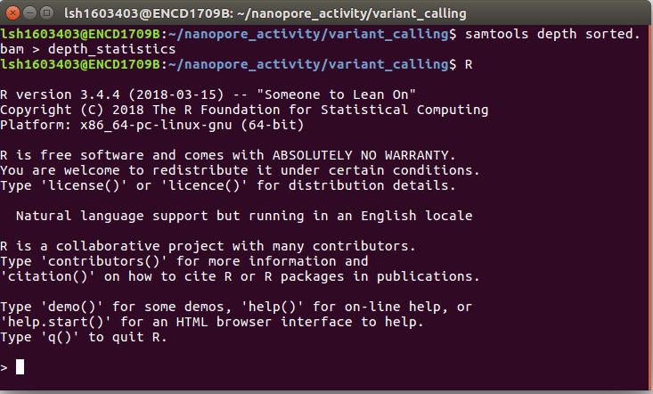

# Third Generation Sequencing

## Introduction

In this session we are going to be looking at data generated by third-generation nanopore sequencing technology. Developed by Oxford Nanopore Technologies (ONT), these platforms, rather than the next-generation 'sequencing-by-synthesis approach', make use of an array of microscopic protein ‘pores’ set in in an electrically resistant membrane which guide strands of DNA or RNA through them. Each nanopore corresponds to its own electrode connected to a channel and sensor chip, which measures the electric current that flows through the nanopore. When a molecule passes through a nanopore, the current is disrupted to produce a characteristic ‘squiggle’. The squiggle is then decoded using basecalling algorithms to determine the DNA or RNA sequence in real time. Oxford Nanopore’s most popular platform is the MinION which is capable of generating single reads of up to [2.3 Mb](https://ib.bioninja.com.au/_Media/genome-size-table_med.jpeg) (2.3 million bases).


The MinION is one of 5 scalable platforms developed by ONT. High-throughput applications such as the GridION and PromethION use an array of nanopore flowcells to produce between 5 to 48 times more data than the MinION alone – outputting up to 48 TB of data in one run. More downscaled solutions such as The Flongle and SmidgION use a smaller, single flowcell to generate data. The MinION is a highly portable sequencing platform, about the size of a large USB flash drive. This technology enables researchers to perform sequencing analyses almost anywhere, providing they have the correct equipment to prepare the DNA libraries and analyse the output data.


A complete sequencing run on the MinION platform can generate upwards to of 1TB of raw data, and downstream analyses require a significant amount of computing power, multicore high performance processors and large amounts of RAM. This poses a significant logistical challenge for researchers who want to take advantage of the platform’s portability aspect. Over recent years, the integration of GPUs (graphics processing units) has made it easier to analysis workflows.


## Activity Briefing

Today we will be working with data generated by the [ZIBRA project Faria et al., 2017](https://www.zibraproject.org/). The ZIBRA group used real-time portable sequencing during the 2015 South American Zika virus (ZIKV) outbreak to provide a surveillance framework for tracking ZIKV spread into other geographic regions. With data generated using the MinION during the outbreak, we will follow a typical nanopore data analysis pipeline to produce a whole-genome Zika virus sequence to explore the capabilities of nanopore sequencing and the kind of data it can produce. We will then use maximum-likelihood (ML) techniques for phylogeographic reconstruction, to try and find out where our isolate came from and place it in the context of the wider South American Zika.

## Basecalling

To convert the raw data output produced by the MinION sequencing run in to a usable form we need to perform a process called basecalling. This converts the raw electronic signal which is collected as the DNA passes through the pore, in to base reads – A, C, T or G. To do this we will use a program called Guppy – a software package designed by ONT which uses [recurrent neural nets (RNN)](https://en.wikipedia.org/wiki/Recurrent_neural_network) to interpret the raw signal, which comes in a proprietary '.fast5' format file produced by the sequencer software and convert it in to the standard .fastq format, for use downstream in our pipeline. Users also have the choice of using the experimental [Bonito](https://github.com/nanoporetech/bonito) basecaller which gives the option of training specialised models for specific basecalling applications. As mentioned above, GPUs are used to accelerate the basecalling process. Without a GPU performing basecalling becomes a very slow process, therfore it is advised that users procure a machine with a compatable Nvidia GPU [(more information on this here)](https://esr-nz.github.io/gpu_basecalling_testing/gpu_benchmarking.html).

     

Activate the relevant environment, navigate to the `~/Data/nanopore_activity/basecalling` folder in the home directory, and we’ll start the first step.

```
conda activate nanopore
cd ~/Data/nanopore_activity/basecalling/raw_fast5_reads/ 
```

!!! info
    Use the `ls` command to see what is inside this folder. Use `head` to preview one of the fast5 files. As you might find, it's completely unreadable. This is because at this stage, the data is in a binary format representing the squiggle signal we spoke about previously. We need to basecall this data before we can use it.

Basecalling can be performed in a number of ways. There is an option to perform this while sequencing in the MinKNOW GUI package, however this software provides fewer options in the ways basecalling can be completed and is less powerful. Here, we will use Guppy for maximum flexibility. Since the machines we are working on do not have a GPU available we will have to use the two CPU cores available to us. Therefore, we will only basecall a subset (<1%) of the dataset as an example, and in the subsequent steps we will use a pre-basecalled output.

**Hover over the different elements of the basecalling command to see its function:**

```
~/software/ont-guppy-cpu/bin/guppy_basecaller --config dna_r9.4.1_450bps_fast.cfg --trim_adapters --compress_fastq  --input_path ~/Data/nanopore_activity/basecalling/raw_fast5_reads  --save_path ~/Data/nanopore_activity/basecalling/fastq 
```

!!! info
    Hover over the basecalling model 'dna_r9.4.1_450bps_fast.cfg' in the above command to see an explanation. You can navigate to `/opt/ont/data` to see all of the models available for use. Alternatively, for simplicity, you can use the `--kit` and `--flowcell` flags instead of defining a model. However, by default, using these arguments do not apply the most accurate basecalling models available.

You should now see the bascalling process begin, and a progress bar appear. This may take some time depending on the performance of your machine.


**When the process is completed, you will find the basecalled reads in a .fastq formatted file. Navigate there by typing the following into the terminal:**

```
cd ~/Data/nanopore_activity/basecalling/fastq/pass
```

!!! info
    Use the `ls` command to see what is inside this folder. This directory holds the fastq formatted 'pass' reads from the basecalling process. The reads have a quality score > 7. Use `zcat | head` to preview the compresssed fastq file. Unlike the fast5 files, these are human-readable and contain all of the read data required for downstream analyses. Can you identify any of the common elements of a .fastq format files - similar to the ones you may have encountered in previous sessions? Click [here](https://en.wikipedia.org/wiki/FASTQ_format) to find out more about the FASTQ format.

## Basecalling: Quality Control

Before moving on to the analysis steps, it is important to gauge the quality of your sequencing output. There are numerous factors which dictate the quality of the output data, spanning between quality of the input material, library preparation to software and hardware failure. We will look at some important metrics produced by the sequencer which will give us a feel for how well the run went.

In order to get the run metrics in to a useful form, we will use an pycoQC to produce a range of plots in a HTML output, which we will use to judge the quality of the sequencing run. Something to note, is that in this activity we will only use a small subset of the sequenced reads, or else the analysis would take all day. This subsetting means that the sequencing telemetry may look inconsistent, when compared to a full run.

```
pycoQC -f ~/Data/nanopore_activity/basecalling/fastq/sequencing_summary.txt -o pycoqc_results.html
```

!!! info
    After executing the command you should find a file called 'pycoqc_results.html'. Open them up in the file manager or in the terminal (with the below command) and inspect some of the plots and see what you can find out. As mentioned, the data here are only a small subset of reads, so some of the plots are incomplete. But this should give you a good idea of how this analysis should look.

```
firefox ~/Data/nanopore_activity/basecalling/fastq/pass/pycoqc_results.html
```

Before continuing, quit firefox by clicking the X in the top right corner of the web-browser window.

!!! question
    === "Question 1"
        Approximately how long did the sequencing run take?
    === "Answer 1"
        0.7 hours

!!! question
    === "Question 2"
        What is the N50 of the passed reads (>Q7) for all basecalled reads in this run?
    === "Answer 2"
        N50 = 636 bp

## Adapter Trimming

Nanopore library preparation results in the addition of a sequencing adapter at each end of the fragment. Both the template and complement strands to be sequenced carry the motor protein which means both strands are able to translocate the nanopore. For downstream analysis, it is important to remove these adapters. For this we will use Porechop. This program processes all of the reads in our basecalled fastq file, and removes these adapter sequences. Furthermore, the ligation library prep process can result in conjoined reads, meaning an adapter will be found in the middle of an extra-long read. [Porechop](https://github.com/rrwick/Porechop) will identify these, split them and remove the adapters. In addition, if you use a multiplexing kit to maximise sample throughput, this program will split the reads based on the molecular barcode added to each sample. Our dataset only has one sample, so this demultiplexing won't be necessary.

**Let's launch porechop and remove the adapters from the basecalled fastq file:**

```
porechop -i ~/Data/nanopore_activity/basecalling/fastq/pass/*.fastq.gz -o basecalled_reads.porechop.fastq
```

## Kraken QC

Another method of quality control is to check our reads for sequence contamination from other 'off-target' organisms. This is important in order to firstly, understand how effective your DNA extraction, enrichment and sequencing was. And secondly, to prevent anomalous reads from being incorporated in to assemblies.

Using our basecalled reads we will perform an analysis using Kraken. Kraken is a tool which sifts through each read in a .fastq file and crosschecks it against a database of microorganisms. The output is a taxonomic assignment of each read, enabling to identify if any contamination has occurred. In this case we will be looking for any reads which do not belong to the Zika genome.

**Let’s navigate to the kraken folder to begin the analysis:**

```
cd ~/Data/nanopore_activity/kraken
```

The following line of code is composed of these elements:

`kraken` – calling the Kraken executable

`kraken --db ~/Data/nanopore_activity/kraken/KDB/` - this points kraken to a vast sequence database of relevant microorganisms to cross-check our reads against

`--output temp.krak` – this argument locates the output file

`basecalled_reads.porechop.fastq` – this argument locates the input file

**Type the following command in to the terminal to unleash the Kraken:**

```
kraken --db ~/Data/nanopore_activity/kraken/KDB/ --output temp.krak ~/Data/nanopore_activity/kraken/basecalled_reads.porechop.fastq
```


This file isn't particularly easy to interpret, so we will use a program called [Recentrifuge](https://github.com/khyox/recentrifuge) to transform these data in to a more human-readable format.

```
rcf -k temp.krak -o rcf.html -n taxdump/
```

Try opening the HTML file generated by recentrifuge in a web browser, what can you tell about the sequencing run? Was is successful? Note - due to constraints with the virtual machine, we have generated an alternative report, which can be loaded using the below command. Copy and paste it in to the terminal. If you have any questions about this, ask a demonstrator.

```
firefox rcf.html
```

!!! question
    === "Question 3"
        Can you see any contaminating reads? What organism(s) is/are there?
    === "Answer 3"
        _Cyanobacteria_ and _Betaproteobacteria_

## Mapping and Visualisation

Now that we have varified a successful sequencing run, our basecalled and trimmed Zika-confirmed data are ready to go, we will now map the reads on to a reference genome and perform variant calling. For the first step we will use the BWA program. You may be familiar with the mapping process from previous sessions. Using BWA we will align our .fastq reads to a reference genome. We need to make some slight modifications to the mapping command used previously, as we need to accommodate for some of the features of the nanopore data.

**Move to the mapping directory:**

```
cd ~/Data/nanopore_activity/mapping
```

Now we can use minimap2 to align our qc complete, porechopped reads. Minimap is a fast alignment tools similar to BWA mem. You can find more information about this tool by clicking the link [comparing the two alignment tools](https://lh3.github.io/2018/04/02/minimap2-and-the-future-of-bwa)

```
minimap2 -ax map-ont ./reference.fasta basecalled_reads.fastq | samtools view -q 15 -b | samtools sort -o alignment.bam
```

Finally we need to index the sorted bam file:

```
samtools index alignment.bam
```

**Now that we have successfully mapped the reads to a reference we can visualise them in Tablet, to get a closer look at what our sequencing run looks like.**

Open up tablet by opening up the applications menu from the using the button on the bottom left of the screen, then typing 'tablet' in to the search bar. 

Using the below animation as a guide, open up igv and load the alignment.bam and the reference.fasta files, then click on the ‘contig’ in the pane on the left side of the screen. You will see a loading bar, then the alignment will be shown. In the left ‘contig’ pane you will fine some metrics associated with this dataset.


    
!!! info
    Note the ‘mismatch’ column in the left hand pane. This metric describes the percentage of bases which do not ‘agree’ with the reference file sequence. 

!!! info
    Try bringing up some of the reads you have worked with in previous session. Remember to select the appropriate `.bam` file and the correct reference fasta. Does anything strike you about the contrasting features of the data sets? Scrolling downwards in the alignment viewer on IGV, what do you notice about the ‘structures’ formed by the reads?

**One of the foremost caveats of nanopore sequencing is the high error rate. It is important that we use programs which are sensitive to that - which is why we used the 'ont2d' argument in the mapping stage. Try switching the colour scheme to ‘Variants’ by using the tab in the top left corner of the interface.**


You can take a closer look at the individual bases by zooming in, either by using the sliding bar on the ‘Home’ tab at the top of the screen or by using ‘Ctrl’+Mouse Scroll. The red squares in the ‘Variants’ view represent the mismatched reads.

!!! info
    An important aspect of an effective nanopore sequencing analysis is being able to differentiate between errors or low quality basecalls, and true SNPs. You can see that there are random errors dotted around the screen, like static on a TV. Do you notice that some positions in the alignment have a distinct vertical column of red squares. These are most likely the variants we are looking for, and the key to unlocking our sequence data. These columns represent positions which have a high frequency of basecalls which do not agree with the reference sequence. It is unlikely that random errors will appear in such a manner, and so, in our next analysis we will use these high frequency variants to alter the reference sequence to build a new sequence, in a process called ‘variant calling’.

## Coverage, Depth, and Variant Calling

!!! info
    Variant calling is a process used to identify new genotypes based on the ‘differences’ found our read data. You will have used it in the previous mapping practical at the start of the course. In this case, we are going to be using the alignment you have just generated and compiling a database of SNPs, inferred from positions which have a majority allele which is different from the one found on the reference sequence.

Before starting on variant calling, we first need to do one more QC step. This analysis will tell us how well our reads have aligned to the reference and how comprehensive our sequencing run was. Two key metrics are required for this: reference coverage and read depth. Read coverage tells us the percentage of the reference which has had sequencing reads aligned to it, which allows us to identify any regions that may have not been successfully sequenced. Depth is an equally as important metric: it tells us how many different reads have mapped to the same position. This is a particularly important statistic if you intend on doing variant calling, as regions with low depth may fall prey to false calls due to the random errors we have in our nanopore data. With a high enough read depth, we can be fairly sure that these errors will be ignored.

**We will now use R to generate a plot to allow us to assess the coverage and depth.**

**Navigate to the ‘variant_calling’ folder and we’ll begin:**

```
cd ~/Data/nanopore_activity/variant_calling 
```

We need to use Samtools, a versatile package you will be familiar with, to extract the depth statistics from the .bam alignment file we generated in the previous section. This will generate a file called ‘depth_statistics’.

```
samtools depth ~/Data/nanopore_activity/mapping/alignment.bam > depth_statistics
```

Next, we will use the R statistical package to generate a plot based on the data samtools generated. Simply type ‘R’ in to the terminal to initialise the R interface.

```
R
```



Once you have initialised R, you can enter the following two lines of code, one after the other. The first command will load the ‘ depth_statistics’ file, and the second will generate the plot

```
data<-read.table("depth_statistics")
```

```
plot(data$V3,type="l",xlab="Reference Position", ylab="read Depth")
```

!!! info
    Take a look at the plot you have just generated in R. Does the genome have adequate coverage and depth? What do you notice about the depth of the reads of nanopore generated data, as opposed to Illumina? Furthermore, why do you think there are these block-like increases and decreases in the depth? (Hint: how do you think these sequencing libraries were generated?)

You can quit R by typing:

```
quit()
```

!!! info
    Now that we know the coverage and depth, we can move on to the variant calling. For this, we will use a package called ‘bcftools’. Bcftools will look through the alignment and ‘call’ the positions which do not agree with the reference, count them and compile them in to a database called a VCF. Enter the following code in to the terminal to begin the process:

```
bcftools mpileup -q 8 -B -I -Ou -f reference.fasta ~/Data/nanopore_activity/mapping/alignment.bam | bcftools call -mv -Oz -o calls.vcf.gz
```


Let's take a look inside the VCF file to see what kind of data it contains:

```
zless calls.vcf.gz
```

!!! info
    You can scroll down using the down-arrow key on your keyboard. Can you recall the common features of a VCF file? Press 'q' to quit the 'zless' program to continue with the activity:

Next, we need to index the .vcf file:

```
bcftools index calls.vcf.gz
```

This next line of code will take the calls made in the VCF file and apply them to the reference sequence, changing it based of the differences observe in our reads:

```
bcftools consensus -f reference.fasta calls.vcf.gz -o consensus_sequence.fasta
```

!!! important
    It is important to understand how the reference sequence can effect the consensus outcome. If unchecked, positions with zero coverage will default to reference. This will result in the experimental sequence becoming more like the reference than it actually is. We can use BEDtools mark positions with low coverage which BCFtools will use to mask the zero coverage positions with 'N's.

!!! info
    You will now have a file called ‘consensus_sequence.fasta’. this contains the modified reference, a brand new sequences based on the sequence data we have been working with.


## Sequence Alignment

Now we are going add our consensus sequence to a multiple sequence alignment, to prepare the dataset for phylogenetic inference. First, navigate to the ‘phytogeography’ folder:

```
cd ~/Data/nanopore_activity/phylogenetics
```

In this folder you will find the consensus sequence you have just generated and a pre-built Zika virus sequence dataset, containing the entire* protein coding sequences of all publicly available ZIKV isolates. Let’s open up the dataset in an alignment viewer and take a look at that this kind of data looks like. Like most of the tools you have encountered during this course there are many alternative programs out there that will perform similar tasks, in this instance we will use Aliview. Let’s call up the program and load our dataset:

```
aliview zika_dataset.fasta
```


With Aliview open, you should now see the dataset we will be working with for the rest of the activity. In the left pane you should see the sequence metadata: the unique sequence accession number, the species the virus was isolated from, the country of origin and the date of collection. Spanning across horizontally, you should see the genome sequence to which the metadata is associated with. On the pane at the bottom of the window, you should see a few statistics about the dataset. Have a browse and familiarise yourself with the data and the software interface.

!!! question
    === "Question 4"
        How many sequences are there in the _Zika_ dataset?
    === "Answer 4"
        284

Before we continue with any analyses, we first have to add our new sequence and then align the dataset. Alignment is the process of arranging sequence data in such a way that each sequence may be compared to each other. For this we will use a program called ‘mafft’. This program will rearrange the sequences based on similarity, so that they may be compared in future analyses.

**Close the Aliview window, and open up the terminal ensuring you are still in the ‘phylogenetics’ directory. First, we will add our new consensus sequence to the database by using the ‘cat’ (concatenate) command:**

```
cat zika_dataset.fasta consensus_sequence.fasta > zika_all.fasta
```

Next, we will call up the alignment program and point it in the direction of our unaligned ‘zika_all.fasta’ dataset. The alignment command is made up of the following elements:

`mafft` – calls the mafft alignment software

`zika_all.fasta` – the input file 

`>` - this symbol ‘points towards’ the output file 

`zika_all_aligned.fasta` – this is the name of the output file 

```
mafft zika_all.fasta > zika_all_aligned.fasta
```

The program may take a short while to run. Alignments generally can take a very long time; some of you may be familiar with using the ClustalO or MUSCLE web-based servers. While these are a few of the more popular options, MAFFT has its merits, particularly in being able to build large alignments in an exceptionally short amount of time.

!!! info   
    Once the program has completed, you should find a file called ‘zika_all_ailigned.fasta’. Open it up in Aliview and inspect the sequences. Comparing this to the unaligned dataset, can you see how easy it is now, to compare each sequence and visualise the diversity across the dataset. With our sequence added to the dataset, we can now move on to the final section of the activity: phylogenetics.

## Optional Activity

!!! info
    Another functionality of Aliview is being able to translate nucleotide sequences in to amino acid sequences. Using this function, we can look further in to our dataset at significant non-synonymous mutations, which result in a change in the amino acid sequence. Microcephaly and neuropathologies associated with Zika have only been reported recently, most prevalently in the Americas. In our dataset we have some ancestral strains, from the Pacific Islands and South-East Asia. Using the translate function in Aliview, we can assess the diversity of our dataset, and investigate the prevalence of particular significant mutations.

In order to gain a better understanding of the differences between the seemingly more pathogenic South American Zika and the less pathogenic Asian strains, Yuan et al. (2017) investigated recent stable mutations in the genome of contemporary South American Zika strains. Using mouse models and recombinant Zika strains, they studied the in vivo neurovirulence phenotypes of three contemporary ZIKV strains isolated in 2015–2016 in South America, and compared them with the phenotypes of their Asian ancestral strain isolated in Cambodia in 2010. They found a particular mutation, S139N, which in vitro, made the virus more infectious for mouse and human neural progenitor cells and promoted apoptosis. 

**Let’s find this site in our dataset and see if our isolate has the S139N genotype:**

We can translate the dataset by pressing **CTRL + SHIFT + T**. You should now see the same dataset expressed as amino acid sequences. Notice all of the ‘X’ residues in the sequences. These are stop codons, however they should not be there, in fact these residues are ‘nonsense’ – codon changes which result in a stop codon. In order to get the ‘true’ amino acid sequence, we need to select the correct reading frame. Press SHIFT + - (shift and the minus/hyphen key). You should now see fewer stop codons in the alignment, and a change in the amino acid sequence. 

By using the scroll bar at the bottom of the window, we can now navigate to the position in the alignment with the S139N mutation to assess what the genotype of our isolate is. In this instance you will find this mutation at the 138th position, due to our alteration of the reading frame. 
What can you tell about our 'consensus' isolate? Do you notice any pattern in the geography of the isolates which contain the S genotype?

## Phylogenetics: IQ-Tree

IQ-tree is the tool we will be using today to infer our phylogenetic tree. It is a popular program for phylogenetic analyses of large datasets. Its main strengths are its speed and a robust search algorithm resulting in phylogenies with good likelihood scores. The maximum likelihood method uses standard statistical techniques for inferring probability distributions, and to assign probabilities to particular possible phylogenetic tree topologies (the shape of the tree). Hopefully you should be familiar with the basic concepts underpinning phylogenetics, and their applications: so let’s get stuck in.

We first need to decide on a substitution model: the mathematical framework which describes the way in which nucleotides change across time. In this instance we will use the GTR model. Explaining these models is beyond the scope of this tutorial, however it is important to understand why you would use a particular model. The reason we have selected GTR (General Time Reversable), is because the GTR substitution model is one of the more robust, widely used models available and most importantly is applicable to our dataset.

Now we have our multiple sequence alignment, we can now start the phylogenetic inference. The following command consists of these elements:


`iqtree` – this calls the iqtree program

`-m GTR+G` – specifies the substitution model

`-s input.fasta` – specifies the input sequence file

`-bb 1000` – specifies the bootstrap replicates

From inside the ‘phylogenetics’ folder, run the following command in the terminal:

```
iqtree -m GTR+G -s ./zika_all_aligned.fasta -bb 1000 -nt AUTO
```

!!! info
    Inferring phylogenies is a complex process can take a very long time, depending on the program you use and the size of the dataset. Because we will not have access to HPC (High Performance Computing) in this activity, we will run only 1 inference. However, in the next step, you will be provided with a tree inferred with the same data, but run with 1000 inferences i.e the program will have been run 1000 times. This gives the program the opportunity to explore the phylogenetic landscape further, so that the resultant tree is the most probabilistically robust.


!!! info
    If you have any questions about this phylogenetic application, or any others you are aware of, don't hesitate to ask a demonstrator.

Now that IQ-Tree has completed its run we can now visualise the results in Figtree – a phylogenetic tree visualisation software package.

**Run the following command:**

```
figtree ./zika_all_aligned.fasta.treefile
```


Now that you have opened up the tree in Figtree, you first need to assign the bootstrap data to a category. We can then organise the tree in a way that it is more easy to view. Using the animation below as a guide, select the 'Midpoint Root' and 'Increasing Node Order' settings.


Use the scroll bars in the Figree window, and on the pane on the left hand side of the windows to zoom and navigate the tree.

**You can use the search bar in the top right corner of the screen to find our 'CONSENSUS' sequence.**

!!! info
    Now that we can see where our sequence falls on the tree, we can look in to the geographical and chronological metadata in our dataset and the structure of the tree, to gain a deeper understanding of what happened during the Zika outbreak in the Americas.

!!! question "Exercise"
    
    === "Question 6"

        What is the closest ancestor of our sequence?
    
    === "Answer 6"

       Brazil - 13/04/2016

!!! info
    What can you tell about the outbreak from the topology (shape and order) of the tree? Can you see distinct clades (groupings) in the overall structure of the tree? As you follow the nodes in each clade further in to the tree, towards the leaves, what to notice about the geography of the isolates in this dataset? Can you tell where most of the lineages began?

**We can use the phylogenies similar to the one we have just generated to map transmission and the spread of diseases.**

!!! info
    Click on the 'Phylogeography Map' link. the program it will take you to was built using a similar Zika dataset that we have used today, with a few extra added isolates. To generate this map, we used Bayesian ancestral state reconstruction with a molecular clock to map the spread of Zika during the 2015-16 outbreak. Do you notice the similarities between the structure of the tree in Figtree and the phylogeographic map?

[Phylogeography Map](https://jodyphelan.github.io/genomics_course/phylogeography/index.html)

## Conclusion

Hopefully having completed this activity, you will have gained a better understanding of how to process third-generation nanopore data, and the applications of such a technologies in an infectious disease outbreak scenario. The pipeline we have used in this activity is one of a hundred you can use to carry out similar tasks, but choosing the right tools for the job is paramount when performing sequence analysis.

The use of front-line genomics during outbreaks is a somewhat novel practice, but with tools such as the MinION and its downstream applications, it is possible to monitor the dynamics of disease outbreaks in real-time to inform on-the-ground containment strategy and provide a framework for surveillance, both in a preventative and a post-outbreak context.


If you have any further questions about this activity or your own applications of this skills learnt during this course, ask a demonstrator.
